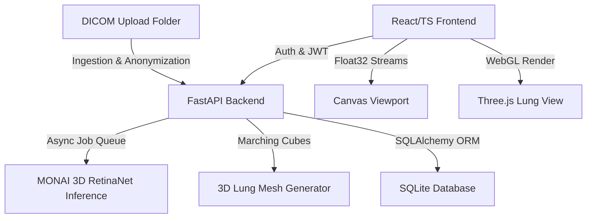

# PneumoGuard AI: Pulmonary Nodule Analyzer

PneumoGuard AI is an industrial-grade, secure, web-based medical platform designed for volumetric 3D Chest CT scan analysis, automated pulmonary nodule detection, and structured clinical reporting. Utilizing a pretrained **3D RetinaNet** model from the **MONAI Model Zoo** (pretrained on the LUNA16 dataset), the system provides radiologists with AI-assisted diagnostics, interactive 3D WebGL lung contour visualization, and GDPR-compliant local DICOM ingestion.

---

## 🚀 Key Features

### 1. GDPR-Compliant local DICOM Ingestion
*   **Anonymization Engine:** Automatically scrubs 24 distinct patient-identifying DICOM headers (such as `PatientBirthDate`, `InstitutionName`, `ReferringPhysicianName`) to ensure strict compliance with HIPAA and GDPR guidelines.
*   **Secure Pseudonymization:** Replaces identifying values with cryptographic hashes (`PATIENT_HASH`) and dynamically computes patient age from DICOM metadata.
*   **Volumetric Folder Upload:** Supports selecting entire local folders of slice images (using browser folder uploads) and filters out non-DICOM files dynamically.

### 2. High-Performance 3D AI Nodule Detection
*   **Deep Learning Pipeline:** Executes 3D convolutional inference using a pretrained MONAI **3D RetinaNet** with a **3D ResNet-50 backbone** and **3D Feature Pyramid Network (FPN)**.
*   **Preprocessing Standardization:** Resamples scans to a uniform physical spacing ($0.703125 \times 0.703125 \times 1.25$ mm), standardizes voxel orientation to RAS (Right-Anterior-Superior), and normalizes density values from Hounsfield Units (HU) between $-1024$ and $+300$ to the $[0.0, 1.0]$ range.
*   **CPU Downsampling Optimization:** For environments without CUDA-enabled GPUs, the backend automatically performs trilinear downsampling to a size divisible by the model's spatial constraints to avoid RAM exhaustion.
*   **Post-processing (NMS):** Resolves duplicate bounding boxes using 3D Non-Maximum Suppression (NMS) with an IoU threshold of $0.22$ and returns candidates exceeding a classification probability score threshold of $0.15$.

### 3. Interactive WebGL 3D Lung Volume Visualizer
*   **Volumetric Lung Contour:** Renders a solid, semi-transparent 3D lung mesh model constructed via the **Marching Cubes** algorithm in the backend.
*   **Interactive Tumor Hotspots:** Overlays AI-detected nodules as glowing red spheres positioned at their exact spatial physical world coordinates inside the lungs.
*   **WebGL Integration:** Powered by **Three.js** to enable smooth drag-to-rotate, mousewheel zooming, auto-rotation, and double-click camera resetting.

### 4. Cornerstone3D-Inspired Canvas Viewport
*   **Binary Slice Streaming:** Streams normalized float32 pixel arrays from the FastAPI backend to an HTML5 canvas for GPU-accelerated rendering.
*   **Windowing Presets:** Quick toggle between **LUNG preset** (WW: 1500, WL: -600 HU for lung parenchyma) and **SOFT preset** (WW: 400, WL: 40 HU for soft tissue/mediastinum).
*   **PACS Mouse Controls:**
    *   *Contrast/Brightness:* Click and drag the mouse on the viewport to adjust window width (WW) and window level (WL) custom ranges.
    *   *Panning:* Click and drag to navigate zoomed images.
    *   *Zooming:* Scrollwheel magnification (only active when the Zoom tool is selected to avoid conflict with slice navigation).
*   **Cursor HUD Overlay:** Displays current slice thickness, zoom factor, active tool, coordinates, and real-time Hounsfield Unit (HU) values beneath the cursor.

### 5. Structured Clinical Reporting & Finalization
*   **Checklist Validation:** Lets radiologists select which AI-detected nodules to officially verify and include in the clinical report findings table.
*   **Sign & Lock Workflow:** Electronically signs reports under the active clinician's account, freezes inputs from retroactive modification, and saves the final diagnostic record in the archive.
*   **Archive Lookup:** Provides a unified search panel to filter studies by name, status, or date.
*   **PDF Report Generator:** Generates a lightweight, structured clinical report including demographics, findings list, and high-resolution snapshots of target CT slices containing the nodules.

---

## 🛠️ System Architecture

The platform uses a decoupled client-server architecture built on modern web and scientific Python packages:



### Tech Stack
*   **Frontend:** React 18, TypeScript, Vite, Tailwind CSS, Three.js (WebGL), Axios, React Router.
*   **Backend:** FastAPI (Python), PyTorch, MONAI, PyDicom, SQLite, SQLAlchemy.

---

## 📂 Directory Layout

```
.
├── backend/
│   ├── models/
│   │   └── lung_nodule_ct_detection/
│   │       ├── configs/         # MONAI bundle settings (inference.json, metadata.json)
│   │       └── models/          # Pretrained checkpoint weights (model.pt)
│   ├── storage/
│   │   └── dicom_uploads/       # Uploaded DICOM study folders
│   ├── ai_model.py              # RetinaNet inference pipeline & CPU downsampling
│   ├── dicom_service.py         # GDPR anonymization & HU normalization
│   ├── main.py                  # FastAPI server entry point
│   ├── models.py                # Database ORM models
│   ├── scans_router.py          # Scan metadata & slice streaming endpoints
│   └── seed_db.py               # SQLite tables seeder (admin/radiologist credentials)
├── frontend/
│   ├── src/
│   │   ├── components/
│   │   │   ├── CornerstoneViewport.tsx    # 2D Slice Canvas Renderer
│   │   │   ├── ThreeDVolumeViewport.tsx  # Three.js 3D Lung Mesh Viewport
│   │   │   ├── HelpGuide.tsx             # Interactive platform reference manual
│   │   │   ├── SecureLogin.tsx           # Authentication console
│   │   │   ├── WorklistDashboard.tsx     # Ingestion & Studies dashboard
│   │   │   ├── StructuredReporting.tsx   # Report form & nodule checklist
│   │   │   └── StudyArchive.tsx          # Archived reports & PDF generation
│   │   ├── App.tsx                       # React Router paths
│   │   └── index.css                     # Design tokens & global CSS styles
└── README.md
```

---

## 🚀 Installation & Setup

### Prerequisites
*   Python 3.10+
*   Node.js 18+
*   *(Optional)* CUDA-compatible GPU (recommends at least 8GB VRAM) for accelerated AI inference.

### 1. Backend Setup
1. Navigate to the backend folder:
   ```bash
   cd backend
   ```
2. Create and activate a Python virtual environment:
   ```bash
   python -m venv venv
   # On Windows:
   .\venv\Scripts\activate
   # On Linux/macOS:
   source venv/bin/activate
   ```
3. Install dependencies:
   ```bash
   pip install -r requirements.txt
   ```
4. Initialize the SQLite database and seed initial clinician accounts:
   ```bash
   python seed_db.py
   ```
5. Run the FastAPI development server:
   ```bash
   python -m uvicorn main:app --port 8000 --reload
   ```

### 2. Frontend Setup
1. Navigate to the frontend folder:
   ```bash
   cd ../frontend
   ```
2. Install npm dependencies:
   ```bash
   npm install
   ```
3. Run the Vite development server:
   ```bash
   npm run dev
   ```
4. Open the platform in your browser at `http://localhost:5173/`.

---

## 🔐 Credentials (Seeded Users)

You can log in to the medical platform using any of the following credentials generated during DB seeding:

| Role | Username / Email | Password |
| :--- | :--- | :--- |
| **Administrator** | `admin@pneumoguard.com` | `adminpass123` |
| **Radiologist** | `radiologist@pneumoguard.com` | `radiologistpass123` |
| **Auditor** | `auditor@pneumoguard.com` | `auditorpass123` |

---

## 🔗 Core API Endpoints

### Authentication
*   `POST /api/auth/token` - Authenticates user and returns JWT access token.
*   `POST /api/auth/register` - Registers a new user account.

### Scans & Slice Streaming
*   `GET /api/scans` - Lists all patient scans.
*   `GET /api/scans/{scan_id}/metadata` - Retrieves dimensions, thickness, and findings of a study.
*   `GET /api/scans/{scan_id}/slices/{slice_index}` - Streams binary float32 pixel arrays for a specific slice.
*   `DELETE /api/scans/{scan_id}` - Deletes study files and database records.

### 3D Volumetric Mesh
*   `GET /api/scans/{scan_id}/3d-volume` - Generates and returns the lung contour vertices, faces, and centered nodule centroids for WebGL rendering.

### Reporting & Archive
*   `POST /api/scans/{scan_id}/confirm` - Confirms manually corrected patient metadata during ingestion.
*   `POST /api/scans/{scan_id}/report` - Saves, locks, and signs the structured diagnostic report.

---

## 🛡️ DICOM Header Anonymization Mapping

The following identifying tags are cleared or mapped to protect patient confidentiality:

*   **Identifiers Removed:** `PatientName`, `PatientID`, `PatientBirthDate`, `PatientSex`, `PatientAge`, `InstitutionName`, `ReferringPhysicianName`, `PerformingPhysicianName`, `OperatorsName`.
*   **Study Metadata Retained:** `SeriesInstanceUID`, `StudyInstanceUID`, `SOPInstanceUID`, `Rows`, `Columns`, `PixelSpacing`, `SliceThickness`, `ImagePositionPatient`, `ImageOrientationPatient`, `RescaleSlope`, `RescaleIntercept`.

---

## 👥 Contributors

*   **Madame Hua CAO** - Project Director & Academic Coordinator (Junia ISEN Lille)
*   **Mishael Natth VISWANATHAN** - Lead Full-Stack Developer, Database Architect, UI/UX Engineer, 3D WebGL Rendering & AI Specialist
*    **Remy Agez** -  Full-Stack Developer, Database Architect, UI/UX Engineer, 3D WebGL Rendering & AI Specialist
*---**Mohamed Lamine Thiaw** -  Full-Stack Developer, Database Architect, UI/UX Engineer, 3D WebGL Rendering & AI Specialist

## ⚖️ License & Medical Disclaimer

This project is developed for educational and research demonstration purposes under the supervision of Junia ISEN Lille. **It is not certified for clinical diagnostic use.** Output calculations, AI detections, and confidence bounds should be verified by a certified healthcare professional.
